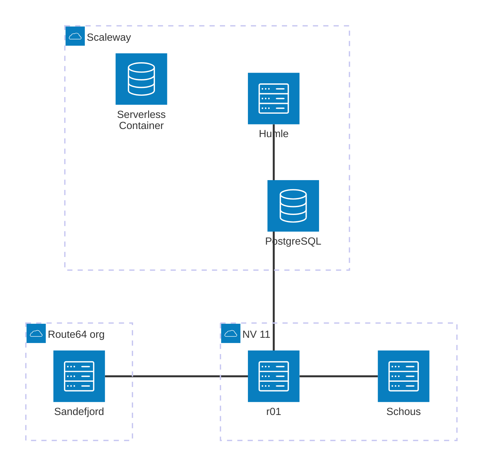

# Diagrams

```mermaid
architecture-beta
    group scaleway(cloud)[Scaleway]
    service humle(server)[Humle] in scaleway
    service postgres(database)[PostgreSQL] in scaleway
    service serverless-container(database)[Serverless Container] in scaleway

    group route64(cloud)[Route64 org]
    service r64(server)[Sandefjord] in route64

    group office(cloud)[NV 11]

    service r01(server)[r01] in office
    service schous(server)[Schous] in office

    schous:L -- R:r01
    r01:T -- B:humle
    r01:L -- R:r64
```
