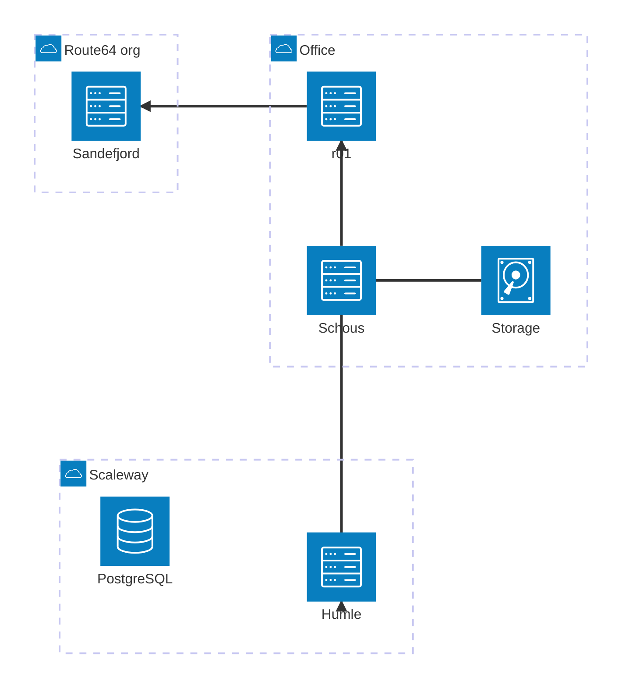

# Diagrams

```mermaid
architecture-beta
    group scaleway(cloud)[Scaleway]
    service humle(server)[Humle] in scaleway
    service postgres(database)[PostgreSQL] in scaleway

    group route64(cloud)[Route64 org]
    service r64(server)[Sandefjord] in route64

    group office(cloud)[Office]

    service disk(disk)[Storage] in office
    service r01(server)[r01] in office
    service schous(server)[Schous] in office

    humle:B <-- T:schous
    r64:R <-- L:r01
    r01:B <-- T:schous

    schous:R -- L:disk
```
